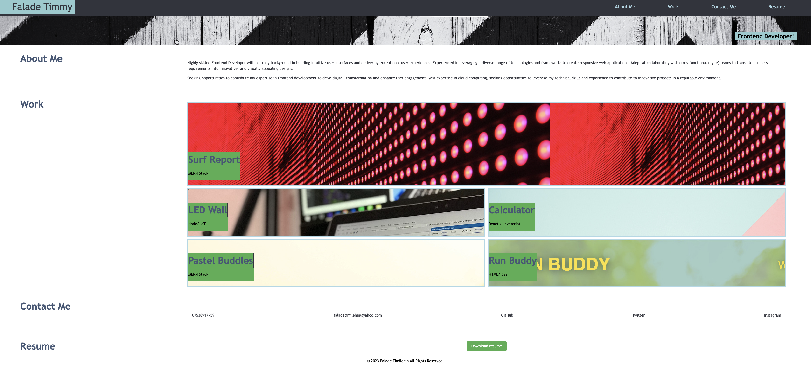

# FALADE PORTFOLIO

## Description

My personal portfolio which features some of my github projects as well as my resume and technical skills.

## Summary

- [Description](#description)
- [User Story](#user-story)
- [Acceptance Criteria](#acceptance-criteria)
- [Mock-Up](#mock-up)
- [Technologies Used](#technologies-used)
- [Usage](#usage)
- [Deployment](#deployment)

### User Story

```
Creating a portfolio from my github
```

### Acceptance Criteria

- Create a portfolio based on a design decision
- Use media queries to create a portfolio across different screens

### Mock-Up

The following image shows the web application's appearance and functionality:



### Technologies Used

- HTML
- CSS

### Usage

You can clone this repository using `git clone https://github.com/faladetimilehin/falade-portfolio` or ssh `git clone git@github.com:faladetimilehin/falade-portfolio.git`

### Deployment

https://faladetimilehin.github.io/falade-portfolio/

> **Note**: This layout is designed for desktop viewing, so you may notice that some of the elements don't look like the mock-up at a resolution smaller than 768px.
